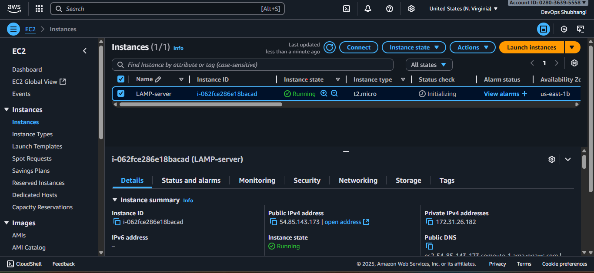
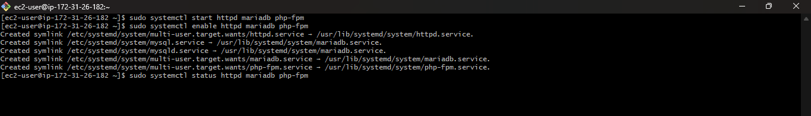
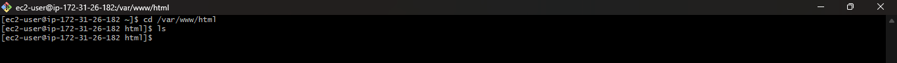
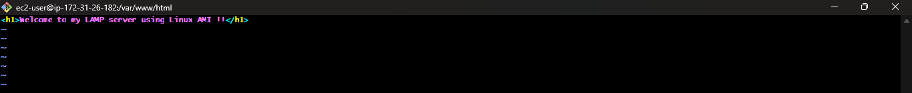
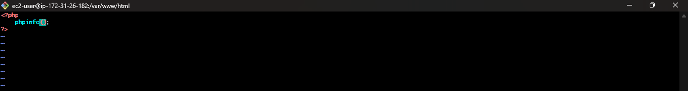
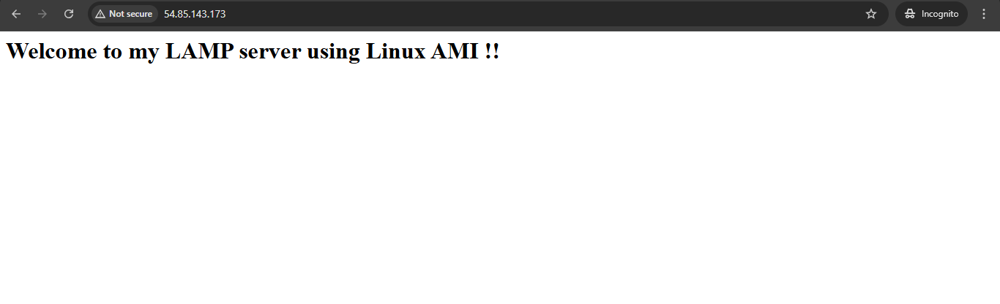
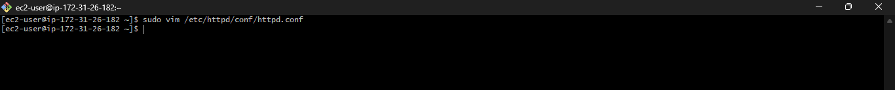
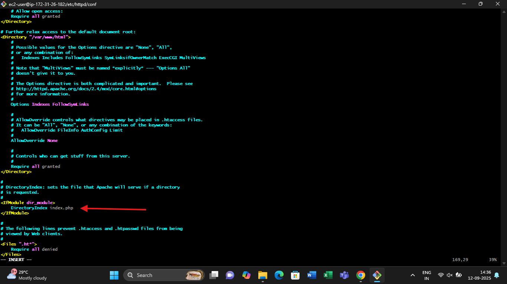
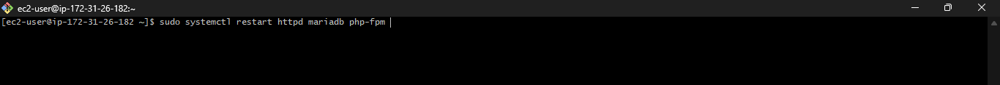
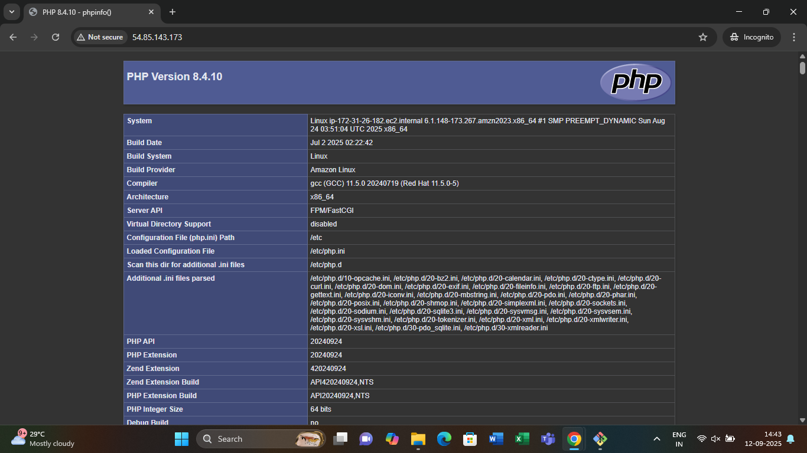

# LAMP Stack Setup on Amazon Linux (EC2)

This guide covers installing and configuring the **LAMP stack** (Linux, Apache, MariaDB, PHP) on an **Amazon Linux EC2 instance**.

---

##  Prerequisites
- An **AWS EC2 instance** (Amazon Linux AMI).
- Security Group allowing:
  - **Port 22 (SSH)**
  - **Port 80 (HTTP)**
  - **Port 443 (HTTPS)** (optional).
- SSH access with a `.pem` key.

---

##  Step 1: Connect to EC2
```bash
ssh -i your-key.pem ec2-user@your-ec2-public-ip
```

---


##  Step 2: Update Packages
```bash
sudo yum update -y
```
---


##  Step 3: Install Apache (httpd)
```bash 
sudo yum install httpd mariadb105-server php -y
```
```bash 
sudo yum install php-fpm 
```
Enable serrvices :
```bash
sudo systemctl start httpd mariadb php-fpm
sudo systemctl enable httpd mariadb php-fpm
sudo systemctl status httpd mariadb php-fpm
```
---



---


## Step 4: Create Web Pages
Move to the web root and create index.html and index.php files :
```bash
cd /var/www/html
```

---

Create an `index.html` file in default root using vim :
```html
<h1>Welcome to my LAMP server using Linux AMI !</h1>
```

---
### Create an `index.php` file:

---

##  Step 5: Restart Services
```bash
sudo systemctl restart httpd mariadb php-fpm
```

---

##  Step 6: Verify in Browser
- Visit  `http://your-ec2-public-ip`  
  By default, you’ll see **index.html**. 
  

- To make **index.php** the default page, edit Apache config:

```bash
sudo vim /etc/httpd/conf/httpd.conf
```


Look for the line starting with:
```
DirectoryIndex index.html
```

Change it to:
```
DirectoryIndex index.php index.html
```


Save & exit, then restart :
```bash
sudo systemctl restart httpd mariadb php-fpm
```


Now when you access `http://your-ec2-public-ip`, the **PHP info page** will load by default.

---


## File & Config Paths :
- Web root: `/var/www/html/`
- Apache config: `/etc/httpd/conf/httpd.conf`

---

## Conclusion :
You have successfully installed and configured the **LAMP Stack on Amazon Linux EC2**.  
- Apache serves web pages.  
- MariaDB is running as your database.  
- PHP executes scripts correctly.  
- `index.php` is the default page. 
